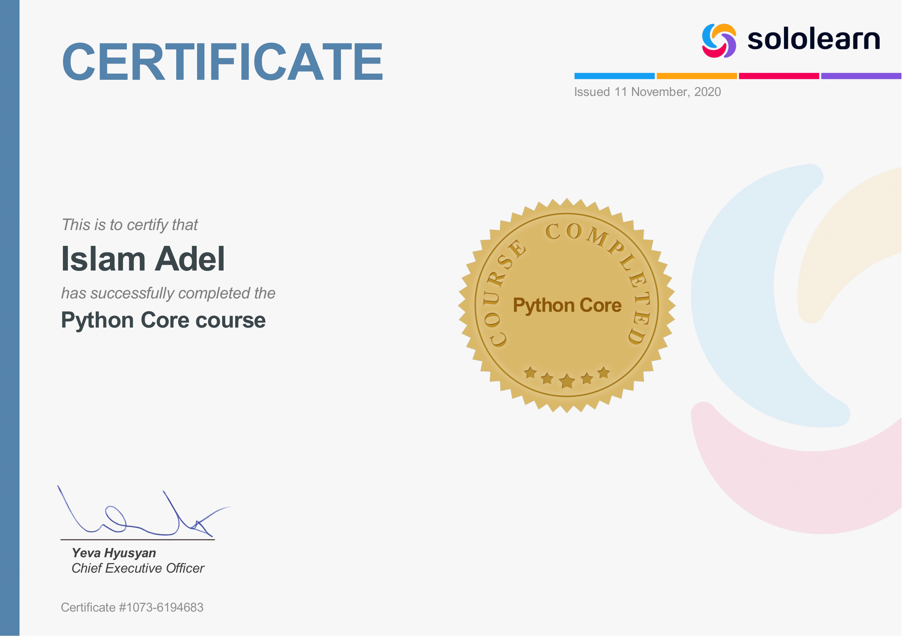

## 🚀 About Me
I'm a 16 years old Python developer from Egypt. I started coding since I was 8 years old I used many langauges including block based and text based langauges but my main langauge is Python which i have been learning for almost two years. 
- 👋 Hi, I’m @SlatchDev
- 👀 I’m interested in programming
- 🌱 I’m currently improving my skills in python
- 💞️ I’m looking to collaborate on real python projects

## 🔗 Links

## 🛠 Skills
- Python | 90%
- C# with Unity | 25%
- C++ | 10%
- Block Based Coding | 100%

## 🎓🧾 Certificates
### SoloLearn (Python Core) 

